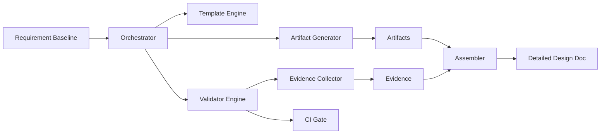

# IT 详细设计 Agent 开发计划 v2（基于框架 v3，交付物先行）

## 1. 目标与策略

### 1.1 目标
在 6 周内建立“项目级、可校验、可被前端/后端/测试/SRE直接消费”的详细设计生产体系，并完成 1 个真实项目试点。

### 1.2 核心策略
1. 交付物先行：先固化标准、模板、Schema，再接入 Agent 自动化。
2. 证据驱动：每个关键设计结论必须有资产读取与工具反馈证据。
3. 门禁前置：在 CI 阶段阻断不合规设计，而不是评审后返工。

---

## 2. 里程碑（6 周）

| 阶段 | 周期 | 核心目标 | Exit Criteria |
|---|---|---|---|
| M0 启动与基线冻结 | 第 1 周前 2 天 | 冻结范围、角色诉求、交付边界 | 范围清单/角色诉求/项目边界评审通过 |
| M1 交付物标准化 | 第 1-2 周 | 完成交付物规范、模板、Schema | MUST 交付物模板与 Schema 完整 |
| M2 校验与门禁 | 第 3 周 | 完成校验器与 CI 门禁流水线 | 样例项目可自动拦截不合规场景 |
| M3 角色消费验证 | 第 4 周 | 验证四类角色可直接消费 | 前后端/测试/SRE演练通过 |
| M4 Agent 接入 | 第 5 周 | 接入 MUST 生成链路（半自动） | >=5 类 MUST 产物可自动生成并过检 |
| M5 试点收敛 | 第 6 周 | 完成真实项目试点并发布 v1.0 | 试点指标达标并形成规范包 |

---

## 3. 技术实现蓝图（补充）

### 3.1 系统架构（逻辑）


### 3.2 核心组件
1. `Orchestrator`：按能力顺序调度生成、校验、汇编。
2. `Template Engine`：读取模板与变量，渲染交付物初稿。
3. `Artifact Generator`：产出 OpenAPI/SQL/Mermaid/JSON。
4. `Validator Engine`：统一执行 lint/schema/一致性校验。
5. `Evidence Collector`：沉淀工具反馈到 `evidence/*.json`。
6. Assembler：汇编项目级详细设计文档。
7. Subagent Runtime：承载能力子代理执行（I/O 契约、工具白名单、失败重试），配置说明优先用中文。
8. Skill Registry：管理每个能力的 Skill 包（模板、规则、脚本、参考资料）。

### 3.3 仓库结构（建议）
```text
/design-system
  /templates
    /artifacts
    /views
  /schemas
    artifact-*.schema.json
    evidence.schema.json
    traceability.schema.json
  /scripts
    render_artifacts.py
    validate_artifacts.py
    check_traceability.py
    assemble_doc.py
  /examples
    /golden-project
  /ci
    pipeline.yml
```

### 3.4 技术栈建议
1. 语言：Python 3.11（脚本与编排）+ Node 20（Mermaid/OpenAPI生态工具）。
2. 关键工具：
- OpenAPI：`spectral`
- AsyncAPI：`@asyncapi/cli`
- SQL：`sqlfluff`
- Mermaid：`@mermaid-js/mermaid-cli`
- JSON Schema：`ajv`
3. 文档汇编：`pandoc`（md -> pdf/docx）

### 3.5 内部接口契约（最小）
1. `POST /projects/{id}/artifacts/render`：生成全部或指定产物。
2. `POST /projects/{id}/artifacts/validate`：执行全量校验并返回门禁结果。
3. `POST /projects/{id}/artifacts/assemble`：汇编最终设计文档。
4. `GET /projects/{id}/reports/traceability`：返回追踪链完整性报告。

### 3.6 关键数据结构（最小）

`artifact-manifest.json`
```json
{
  "projectId": "PRJ-001",
  "version": "v1.0.0",
  "artifacts": [
    {"id":"API-001","path":"artifacts/openapi-internal.yaml","type":"openapi","owner":"backend"}
  ]
}
```

`evidence-record.json`
```json
{
  "capability": "api-design",
  "asset_type": "doc",
  "source": "docs/api/v1.md",
  "tool": "spectral",
  "result_summary": "2 issues",
  "design_impact": "add v2 endpoint",
  "confidence": 0.9,
  "timestamp": "2026-03-06T10:00:00+08:00"
}
```

`traceability.json`
```json
{
  "links": [
    {
      "reqId": "REQ-001",
      "designIds": ["API-001","FLOW-001"],
      "testIds": ["TC-001"],
      "runbookIds": ["OPS-001"]
    }
  ]
}
```

### 3.7 CI 门禁实现（命令级）
```bash
python scripts/render_artifacts.py --project examples/golden-project
spectral lint examples/golden-project/artifacts/openapi.yaml
asyncapi validate examples/golden-project/artifacts/asyncapi.yaml
sqlfluff lint examples/golden-project/artifacts/schema.sql
mmdc -i examples/golden-project/artifacts/sequence-order.md -o /tmp/seq.svg
ajv validate -s schemas/traceability.schema.json -d examples/golden-project/release/traceability.json
python scripts/check_traceability.py --project examples/golden-project
python scripts/validate_artifacts.py --project examples/golden-project
```

### 3.8 非功能目标（对实现提出约束）
1. 单项目全量校验耗时 <= 5 分钟。
2. 校验结果可重复（同输入同输出）。
3. 失败可定位到文件/字段/规则。
4. 汇编过程幂等（重复执行结果一致）。


### 3.9 Subagent + Skill 落地规范（新增）
1. `Orchestrator` 只负责任务编排，不直接实现具体能力逻辑。
2. 每个能力域定义一个 `subagent` 契约文件：
- `agents/<capability>-design.agent.yaml`
- 必填：`inputs`、`outputs`、`tools`、`policies`、`error_handling`
3. 每个能力域定义一个 `skill` 目录：
- `skills/<capability>/SKILL.md`
- 可选：`skills/<capability>/scripts/*`、`references/*`、`assets/templates/*`
4. `subagent` 输出必须匹配 Schema；`skill` 仅提供实现路径，不改变输出契约。
5. 工具调用权限在 `subagent` 定义，`skill` 中仅引用允许工具。

### 3.10 Subagent/Skill 示例目录
```text
/design-system
  /agents
    api-design.agent.yaml
    data-design.agent.yaml
    flow-design.agent.yaml
  /skills
    /api-design
      SKILL.md
      /scripts
      /references
      /assets/templates
```
---

## 4. 第一优先级：交付物标准规范与模板（M1）

### 4.1 MUST 交付物
1. `openapi-internal.yaml`
2. `errors-rfc9457.json`
3. `schema.sql`
4. `architecture.md`
5. `sequence-*.md`
6. `state-*.md`
7. `class-*.md`
8. `ddd-structure.md`
9. `config-catalog.yaml`
10. `test-inputs.md`
11. `coverage-map.json`
12. `slo.yaml`
13. `observability-spec.yaml`
14. `deployment-runbook.md`
15. `traceability.json`
16. `review-checklist.md`

### 4.2 M1 任务拆解（技术实现）
1. 建立 `templates/artifacts` 与 `templates/views` 目录。
2. 为 JSON/YAML 交付物补齐 `schemas/*.schema.json`。
3. 编写 `scripts/render_artifacts.py` 支持模板渲染与变量注入。
4. 输出 `examples/golden-project` 作为金标样例。
5. 新建 `agents/*.agent.yaml` 契约模板（统一命名为 `xxx-design.agent.yaml`，至少覆盖 6 个 MUST 能力域）。
6. 新建 `skills/<capability>/SKILL.md` 模板并定义最小字段约束，说明文字优先用中文。

### 4.3 M1 验收标准
1. 16 个 MUST 交付物全部有模板。
2. JSON/YAML 交付物全部可通过 Schema 校验。
3. 样例项目可完成一次完整渲染。

---

## 5. 第二优先级：校验与门禁（M2）

### 5.1 校验器实现清单
1. `validate_openapi()`
2. `validate_asyncapi()`
3. `validate_sql()`
4. `validate_mermaid_render()`
5. `validate_traceability()`
6. `validate_role_minimum_deliverables()`

### 5.2 CI 流水线阶段
1. `stage:render`
2. `stage:lint`
3. `stage:schema`
4. `stage:trace`
5. `stage:assemble`
6. `stage:publish-report`

### 5.3 M2 验收标准
- 能自动拦截：缺文件、字段缺失、Schema 不符、追踪断链、角色交付缺失。

---

## 6. 第三优先级：角色消费验证（M3）

### 6.1 演练脚本（可执行）
1. 前端演练：根据 `openapi-internal.yaml + errors-rfc9457.json + sequence` 产出联调清单。
2. 后端演练：根据 `module-map + ddd-structure + schema + integration` 产出开发任务。
3. 测试演练：根据 `traceability + state + test-inputs` 产出测试用例矩阵。
4. SRE 演练：根据 `slo + observability + runbook` 产出上线检查单。

### 6.2 M3 验收标准
- 四类角色在不补充口头背景下可独立完成准备动作。

---

## 7. 第四优先级：Agent 能力接入（M4）

### 7.1 接入顺序（MUST 优先）
1. 架构映射
2. API 契约设计
3. 数据与迁移设计
4. 流程/状态设计
5. 测试可设计性
6. 可观测与运行就绪
7. Subagent/Skill 编排接入（按能力域逐步替换手工流程）

### 7.2 运行模式
1. 半自动：`agent generate` + `validator gate` + 人工确认。
2. 自动化：策略稳定后开启自动提交 PR（仍保留人工评审门禁）。

### 7.3 M4 验收标准
- >= 5 类 MUST 产物一次通过率 >= 80%。

---

## 8. 试点与发布（M5）

### 8.1 试点范围
- 1 个中等复杂度项目（含 API/DB/流程/发布）。

### 8.2 指标
1. 设计评审轮次下降 >= 20%
2. 追踪断链率 <= 5%
3. 角色满意度 >= 4/5
4. 发布前问题前移发现率 >= 30%

### 8.3 发布产物
1. 框架文档 v3
2. 模板包 v1.0
3. Schema 包 v1.0
4. 校验器与 CI 门禁规则 v1.0
5. 试点复盘报告

---

## 9. 团队分工

| 角色 | 责任 |
|---|---|
| 架构负责人 | 能力边界、ADR、方案评审 |
| 平台工程 | 脚本开发、CI 门禁、模板引擎 |
| 后端负责人 | API/数据/集成模板与校验规则 |
| 前端负责人 | 契约消费规范与联调视图 |
| 测试负责人 | 追踪与覆盖规则、测试模板 |
| SRE 负责人 | SLO/观测/runbook/发布门禁 |

---

## 10. 本周立即行动（Next 5 Days）
1. Day1：冻结 MUST 交付物清单与字段规范。
2. Day2：完成模板目录与 16 个模板初版。
3. Day3：完成 JSON/YAML Schema 初版。
4. Day4：完成 `render/validate/trace` 三个核心脚本。
5. Day5：跑通 golden-project 全流程并组织四角色评审。


