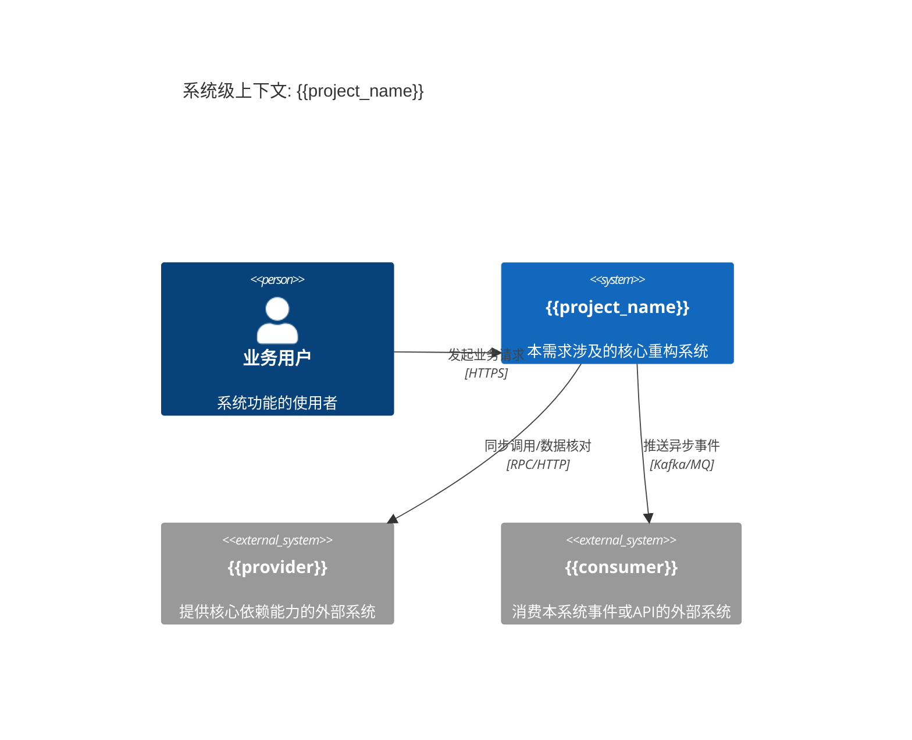
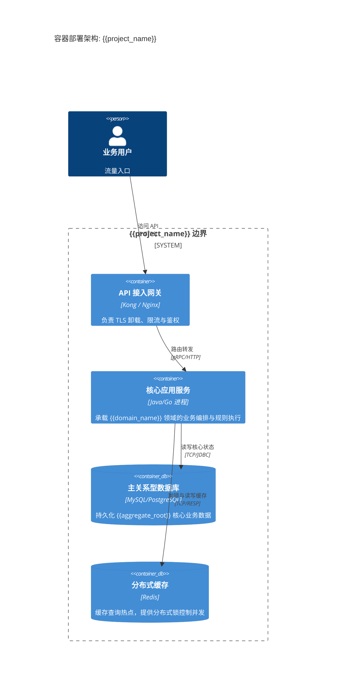

# 架构与边界映射: {{project_name}}

## 1. 系统级上下文 (C4 Context)
本视图明确了 `{{project_name}}` 与外部系统和消费者的交互边界。

## 2. 容器架构部署 (C4 Container)
本视图明确了 `{{project_name}}` 内部的物理进程分布。

## 3. 架构级合规与约束
1. **依赖隔离**: 核心应用服务与 `{{provider}}` 的通信必须在基础设施层实现 防腐层 (Anti-Corruption Layer)，严禁将 `{{provider}}` 的领域模型直接暴露给内部业务逻辑。
2. **读写分离**: 针对 `{{aggregate_root}}` 的高频查询，优先命中 Redis 缓存；写入操作必须双写或利用 Binlog 订阅更新缓存，保证最终一致性。
