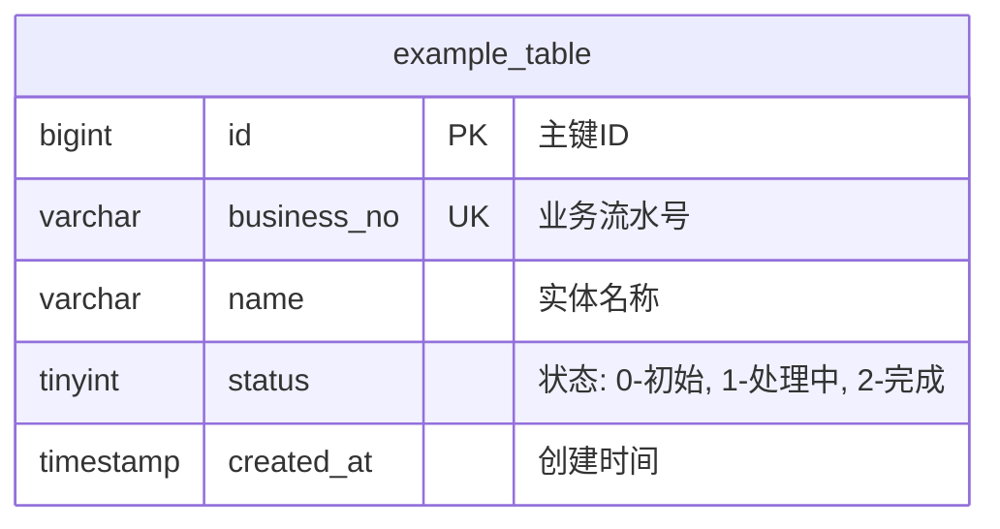

# 实体关系图 (ER Diagram) - {{project_name}}

> **版本**: {{version}}

## 1. 核心实体说明
| 实体名 | 表名 | 描述 |
| :--- | :--- | :--- |
| Example | `example_table` | 示例业务对象 |

## 2. 实体关系 (Mermaid)
以下为系统的核心实体及其关联关系：

## 3. 设计决策说明
- **主键策略**: 采用 `BIGINT AUTO_INCREMENT` 配合全局唯一的业务流水号（如雪花算法生成）作为业务主键。
- **软删除**: 统一使用 `is_deleted` 字段实现软删除，保证数据可追溯。
- **冗余设计**: (如无冗余设计，填无)
