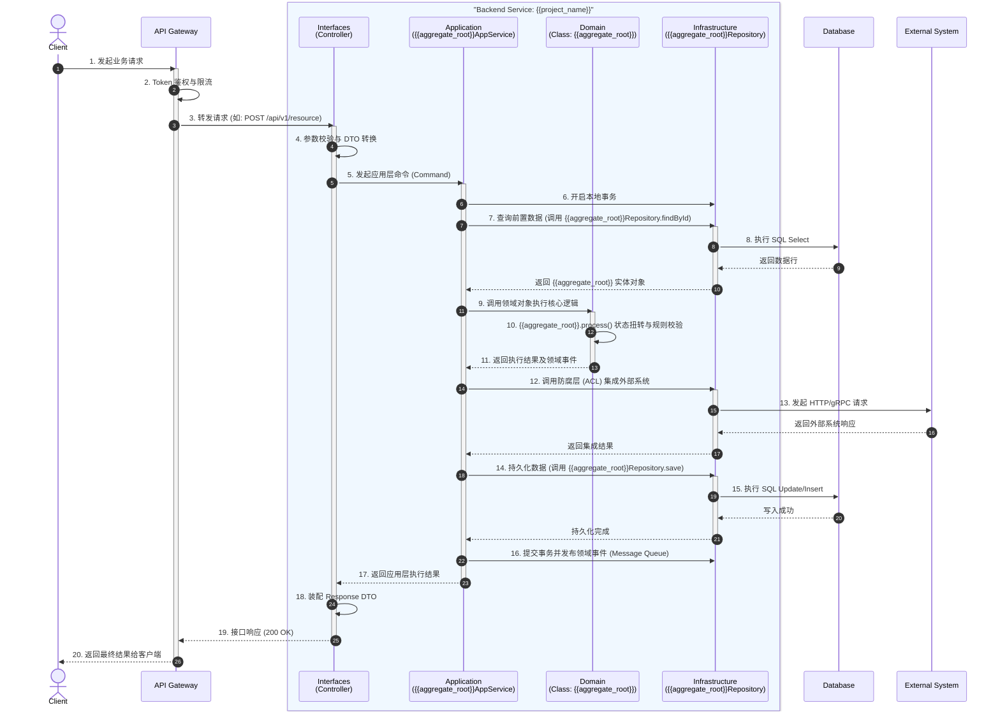

# 时序图: {{scenario_name}}

## 1. 业务场景说明
- **场景描述**: {{scenario_desc}}
- **触发条件**: (描述触发该流程的用户行为或定时任务)
- **前置依赖**: (描述执行该流程必须满足的条件，如：用户已登录)

## 2. 参与者与后端分层 (Actors & DDD Layers)
| 参与者/层级 | 类型 | 职责说明 |
| :--- | :--- | :--- |
| User / Client | Actor | 发起操作的用户或客户端应用 |
| API Gateway | System | 负责统一鉴权、限流与路由分发 |
| **Interfaces** | Layer | 后端接入层，处理 HTTP/RPC 协议，数据校验与 DTO 转换 |
| **Application** | Layer | 后端应用层，负责用例编排、事务控制与权限校验 |
| **Domain** | Layer | 后端领域层，执行纯粹的核心业务逻辑和状态扭转 |
| **Infrastructure** | Layer | 后端基础设施层，负责数据库持久化、缓存及外部 API 调用 |

## 3. 详细交互时序 (Mermaid)
本图详细展示了请求在后端 DDD 四层架构中的流转过程。

## 4. 关键设计约束
- **事务边界**: 事务必须在 `Application` 层开启和提交，严禁跨外部系统调用（如步骤 12）时长时间持有本地数据库事务。
- **依赖倒置**: `Application` 层只依赖 `Repository` 的接口定义（属于 Domain 层），真实的持久化实现由 `Infrastructure` 层在运行时注入。
- **异常处理**: 任何 `Domain` 层抛出的业务异常（如余额不足、状态不对），由 `Interfaces` 层的统一异常拦截器转换为规范的 RFC 9457 格式返回。
