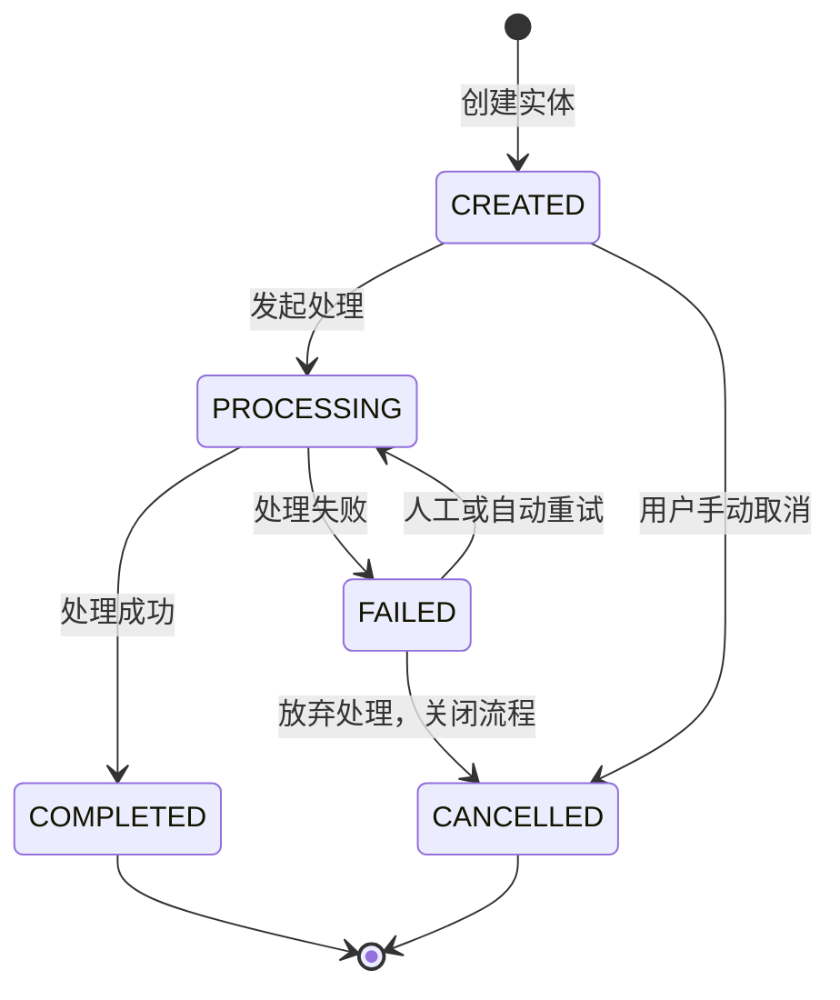

# 状态机设计: {{aggregate_root}}

## 1. 状态机概览
- **核心实体类 (Aggregate Root)**: `{{aggregate_root}}`
- **关联业务场景**: {{entity_name}}
- **初始状态**: `CREATED`
- **生命周期终态**: `COMPLETED`, `CANCELLED`

## 2. 状态流转图 (Mermaid)

## 3. 状态流转规则定义
| 当前状态 | 触发事件 / 接口调用 | 目标状态 | 前置约束条件 / 核心业务逻辑 |
| :--- | :--- | :--- | :--- |
| `CREATED` | 发起处理 (start) | `PROCESSING` | 检查必要参数和关联依赖是否就绪。 |
| `CREATED` | 取消 (cancel) | `CANCELLED` | 释放预占的资源（如库存、额度）。 |
| `PROCESSING` | 异步回调成功 (success) | `COMPLETED` | 记录完成时间，触发后续事件流。 |
| `PROCESSING` | 异常中断 (fail) | `FAILED` | 记录失败原因日志，触发运维告警。 |

## 4. 并发控制与幂等策略
- **状态屏障 (State Barrier)**: 数据库更新时必须携带旧状态作为条件，防止并发导致的非法流转。
  - *SQL 示例*: `UPDATE {{entity_name}} SET status = 'PROCESSING' WHERE id = ? AND status = 'CREATED'`
- **幂等处理**: 对于相同状态的重复推进请求（如 `PROCESSING` 再次收到 `start` 事件），直接返回成功或提示“已在处理中”，不抛出系统异常。
